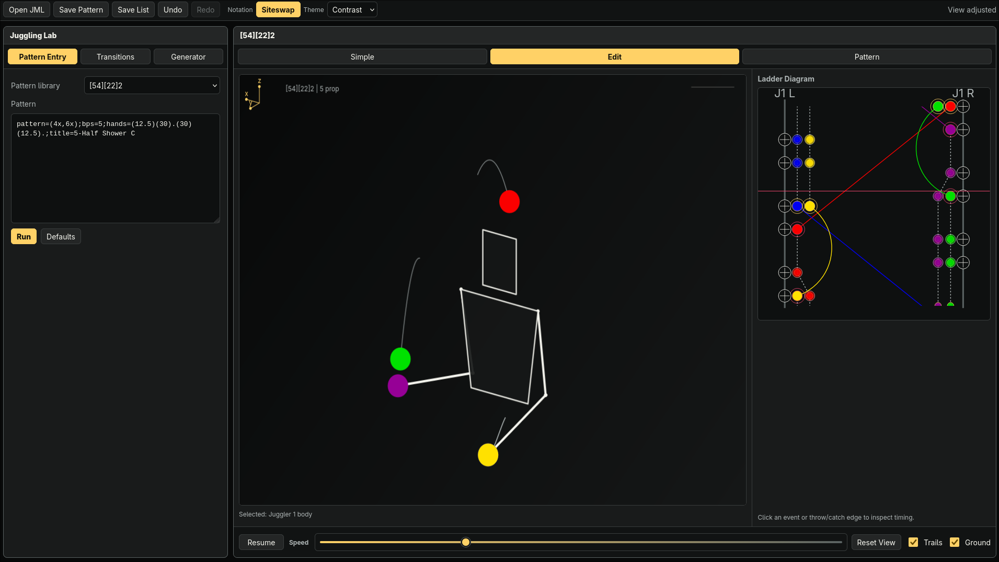

# Juggling Lab



> [!WARNING]
> COPYRIGHT NOTICE

Juggling Lab is a Rust web port of **Juggling Lab**, an open-source juggling pattern animator originally created and maintained by Jack Boyce and contributors.

This repository is based on the original Juggling Lab project:

* Original project: [jkboyce/jugglinglab](https://github.com/jkboyce/jugglinglab)
* Original website: [jugglinglab.org](https://jugglinglab.org/)
* Original license: GNU General Public License version 2

The goal of this project is to preserve the behavior and pattern compatibility of Juggling Lab while rebuilding the application for the web using Rust, WebAssembly, and Leptos. The UI and web renderer may differ from the original project, and additional features may be added over time.

This repository is an unofficial derivative work / Rust web port of the original Juggling Lab project.

## License

This project is licensed under the **GNU General Public License, version 2**.

A copy of the license is included in this repository as [`LICENSE`](./LICENSE).

Because this project is derived from Juggling Lab, this repository preserves the original GPL-2.0 licensing terms. Any redistributed copies, modified versions, or compiled builds of this project must comply with the GNU GPL v2.

## Attribution

This project is based on Juggling Lab by Jack Boyce and contributors.

Original Juggling Lab contributors retain copyright over their respective contributions to the original project. New code, changes, Rust/Leptos porting work, UI changes, and additional features in this repository are copyright their respective authors.

See the original project for the upstream source code, history, and contributor list:

[jkboyce/jugglinglab](https://github.com/jkboyce/jugglinglab)

## Workspace

- `crates/juggling-core`: juggling-only code. JML parsing/writing, siteswap parsing, pattern library loading, animation-domain models.
- `crates/juggling-web`: Leptos client and browser canvas renderer.
- `crates/juggling-server`: Rust backend that serves the web app and WASM assets.
- `public`: HTML/CSS and generated WASM package.

## Build

Build the frontend WASM:

```bash
wasm-pack build crates/juggling-web --target web --out-dir ../../public/pkg
```

Start the backend:

```bash
cargo run -p juggling-server
```